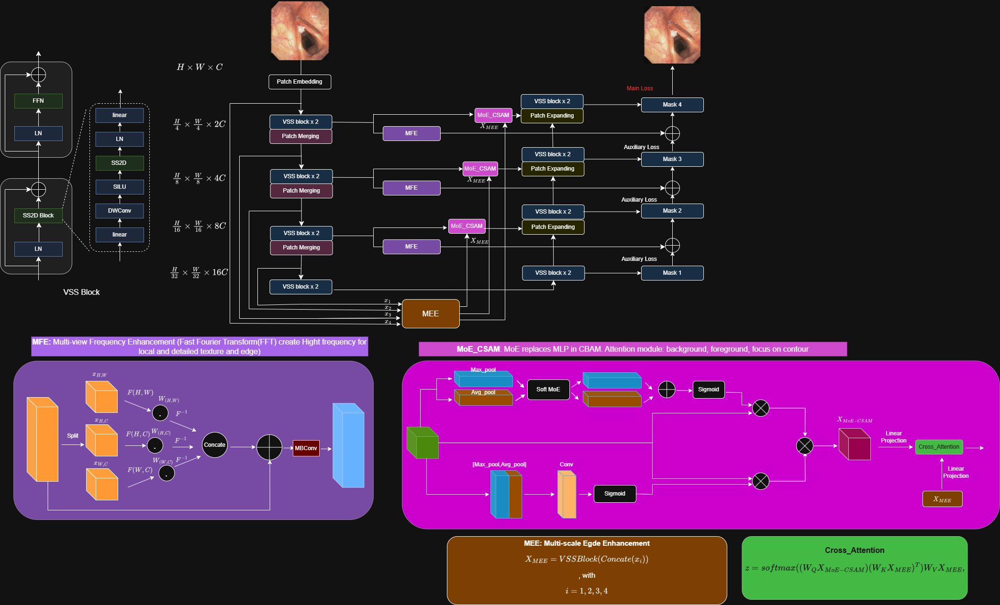

<div align="center">
<h1>3M-Unet</h1>
<h3>Mixture of Expert with Multi-scale Feature Extraction on Mamba for Laryngoscopy Image Segmentation</h3>


### News
* **` Feb, 2025`:** We introduce our model for laryngoscopy image segmentation


## Abstract
Segmentation in laryngoscopy images plays a vital role in evaluating lesion edges and their invasive level to related anatomical structures. However, there has been less research about such a topic until now. In this study, we introduce a novel laryngoscopy image dataset for vocal fold and lesion segmentation. Moreover, we propose a new deep learning-based approach for segmenting glottic anatomical landmarks and lesions in flexible laryngoscopy images. Our method is based on integrating mixture of expert and multi-view edge extraction into state space architecture. We trained and evaluated our model on a dataset of 1724 flexible laryngoscopy images, and achieved an overall Dice coefficient and HD95 of \highlight{Xxx} and \highlight{Xxx}, respectively. We also conducted additional experiments to evaluate the robustness of our method with each subset. The results indicate that our proposed approach not only effectively segments glottic anatomical landmarks and lesions in flexible laryngoscopy images but also obtains efficient computational cost, providing a valuable tool for clinical applications. 

## Overview
<div align="center">

</div>

## Install Repo and Env
- Clone our repository:
  ```bash
  git clone https://github.com/your-username/3M-Unet.git 3munet
  cd 3munet

- Requirements: requirements.txt
   ```bash
  conda create -n 3munet python=3.8
  conda activate 3munet`
  pip install -r requirements.txt

## Download Dataset:
Link to download our dataset at [Drive](https://drive.google.com/drive/folders/1Olydgl7rQTrA2dxXHhkp8BTzJ9HTe2TD?usp=drive_link)

## Train: 
`python train_vofo.py --mode train  # Train and val 3M-UNet on our laryngoscopy image dataset.`

## Evaluation:
`python train_vofo.py --mode test`


**Note**
If you want to visualize:
`python train_vofo.py --mode test --visualize`
It will save the output images in the .\result_vofo\visualize folder, with the colors specified in the config_setting_vofo.py file.


## Acknowledgement :heart:
This project is based on Mamba ([paper](https://arxiv.org/abs/2402.02491), [code](https://github.com/JCruan519/VM-UNet)). Thanks for their wonderful work.

## Citation
If you find our model that is useful in your research or applications, please consider giving us a star 🌟 and citing it in the following BibTeX entry.

```bibtex
 @article{3munet,
  title={3M-Unet: Mixture of Expert with Multi-scale Feature Extraction on Mamba for Laryngoscopy Image Segmentation},
  author={},
  journal={},
  year={2025}
}
```
