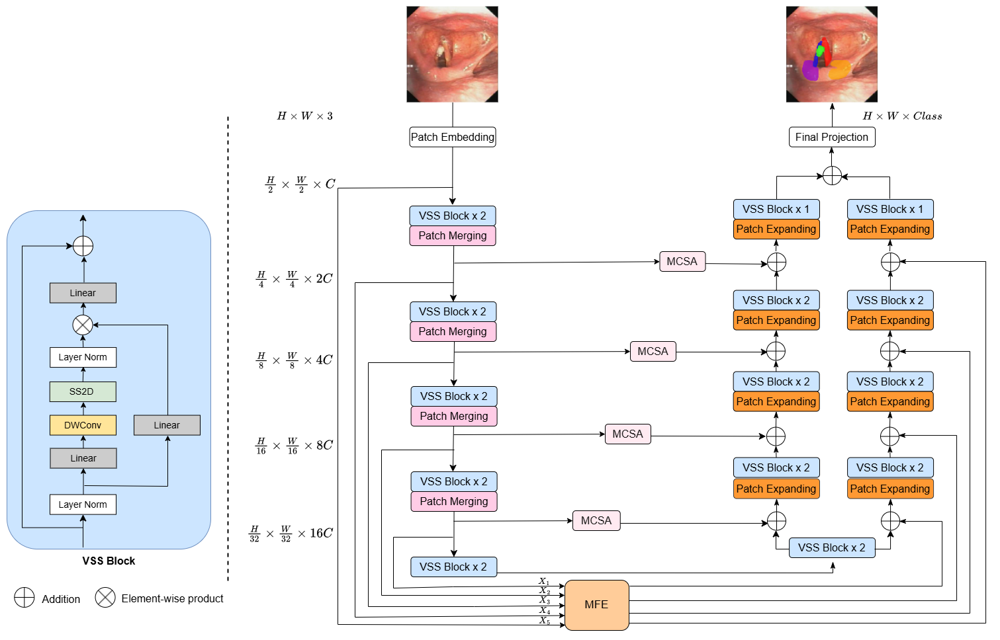
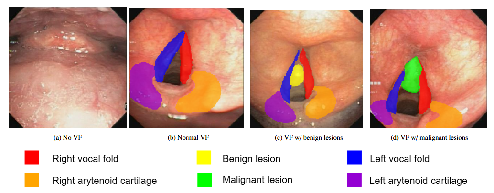

<div align="center">
<h1>3M-UNet</h1>
<h3>Dual Extraction of Multi-channel Attention and Multi-scale Feature on Mamba for Laryngoscopy Image Segmentation</h3>


### News
* **` Feb, 2025`:** We introduce our model for laryngoscopy image segmentation


## Abstract
Segmentation in laryngoscopy images is crucial for assessing lesion boundaries and their degree of invasion into adjacent anatomical structures, helping diagnose and plan treatment. Nonetheless, existing CNN-based and Transformer-based models for laryngoscopy datasets, most of which are small and private, have yet to achieve a balance between computational cost and global attention modeling. In this study, we introduce a novel laryngoscopy image dataset, namely Seg-VoFo, comprising 1,724 expertly annotated images. To facilitate research on segmenting glottic anatomical structures and lesions, along with the dataset, we introduce a novel approach to segment vocal folds and their lesions on laryngoscopy images, serving as a strong baseline for future research. Our proposed method, namely 3M-UNet, is based on integrating multi-channel attention and multi-scale features for suitable edge and texture extraction for a double decoder branch within a U-shaped state space architecture. 3M-UNet outperforms state-of-the-art methods across key segmentation performance metrics, achieving a Dice Similarity Coefficient (DSC) of 0.76 and a mean Intersection over Union (mIoU) of 0.71. Experimental results demonstrate that 3M-UNet effectively segments glottic anatomical landmarks and lesions in flexible laryngoscopy images and obtains efficient computational cost, providing a valuable tool for clinical applications.

## Overview
<div align="center">

</div>

## Install Repo and Env
- Clone our repository:
  ```bash
  git clone https://github.com/your-username/3M-Unet.git 3munet
  cd 3munet

- Requirements: requirements.txt
   ```bash
  conda create -n 3munet python=3.8
  conda activate 3munet`
  pip install -r requirements.txt

## Download Dataset:
Link to download our dataset at [Drive](https://drive.google.com/drive/folders/1Olydgl7rQTrA2dxXHhkp8BTzJ9HTe2TD?usp=drive_link)

<div align="center">

</div>

## Train: 
`python train_vofo.py --mode train  # Train and val 3M-UNet on our laryngoscopy image dataset.`

## Evaluation:
`python train_vofo.py --mode test`


**Note**
If you want to visualize:
`python train_vofo.py --mode test --visualize`
It will save the output images in the .\result_vofo\visualize folder, with the colors specified in the config_setting_vofo.py file.


## Acknowledgement :heart:
This project is based on Mamba ([paper](https://arxiv.org/abs/2402.02491), [code](https://github.com/JCruan519/VM-UNet)). Thanks for their wonderful work.

## Citation
If you find our model that is useful in your research or applications, please consider giving us a star 🌟 and citing it in the following BibTeX entry.

```bibtex
 @article{3munet,
  title={3M-UNet: Dual Extraction of Multi-channel Attention and Multi-scale Feature on Mamba for Laryngoscopy Image Segmentation},
  author={Thao Thi Phuong Dao, Tan-Cong Nguyen, Minh-Khoi Pham, Viet-Tham Huynh, Tuan-Luc Huynh, Trung-Nghia Le,
Trong-Thuan Nguyen, Thuc Nguyen-Quang, Boi Ngoc Van, Chanh Cong Ha, Bich Anh Tran, Thanh Dinh Le, Minh-Triet Tran},
  journal={},
  year={2025}
}
```
